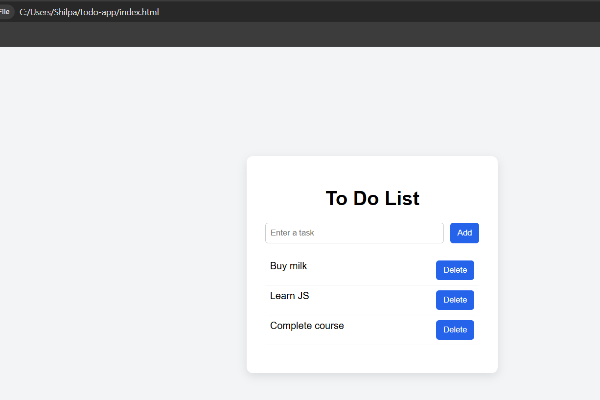

# To-Do App

This is a simple To-Do List application built using **HTML, CSS, and JavaScript**.

The app allows users to add tasks, mark them as completed, and delete tasks.

---

## 🚀 Features

- Add new tasks
- Delete tasks
- Mark tasks as completed
- Simple and clean UI
- Built using pure JavaScript (no frameworks)

---

## 🛠 Technologies Used

- HTML5
- CSS3
- JavaScript (DOM Manipulation)

---

## 📸 Project Preview



---

## ▶️ How to Run

1. Clone the repository

```
git clone https://github.com/ShilpaAM2231/todo-app.git
```

2. Open `index.html` in your browser

---

## 👩‍💻 Author

Shilpa
